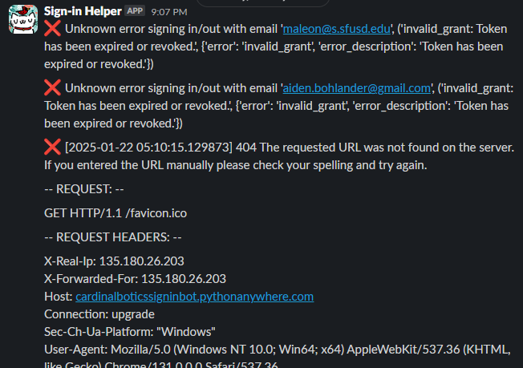

# SlackSignInBot
My robotics team uses a google form for signing in/out, and a spreadsheet for keeping track of the hours of each member. 
This is extremely inefficient as you have to put your email into a form every time you want to sing in or out, and if you arent sure if you're signed in or out you have to hunt down and check a spreadsheet.
This Slack bot wraps the existing system, using posts requests to fill out the form, and the Google sheets API to check if you're signed in or not.
Simply run `/signin-register [email]` to register your email once, and then easily sign in or out with `/ss` or check your status with `/signin-status`.
## Features:
- Easy to use slash commands:

- Complete logging to a channel of your choice:

